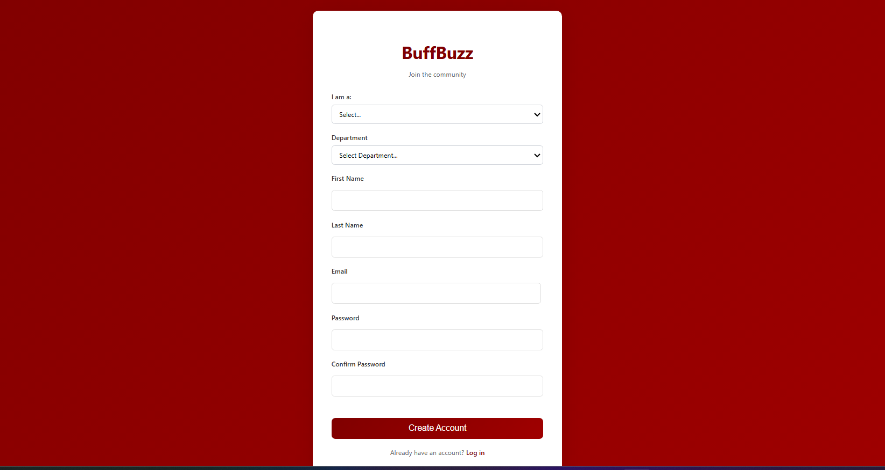
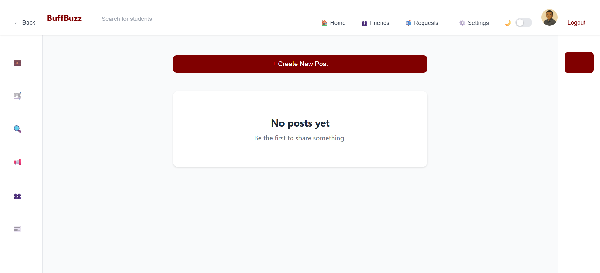
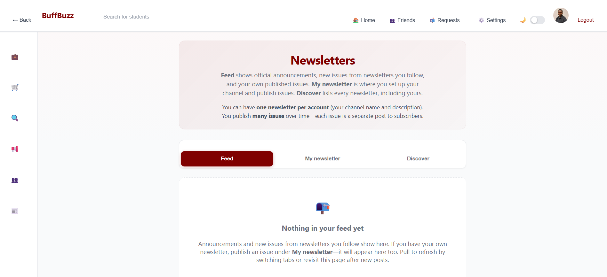
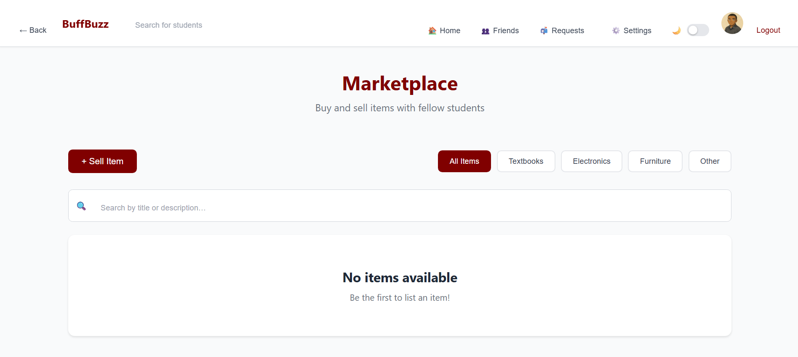

# BuffBuzz 
_A Campus Social Platform for WTAMU Students_  

## Project Overview  
BuffBuzz is a web-based social platform designed to strengthen campus connections at **West Texas A&M University (WTAMU)**.  
Students often ignore official emails but frequently check social media for updates. BuffBuzz replaces scattered communication with a **centralized, student-only network** where students, organizations, and departments can share announcements, chat, and collaborate in real time.  

---

## Tech Stack  
- **Frontend**: React, CSS  
- **Backend**: Node.js 
- **Database**: PostgreSQL + Prisma ORM  
- **Authentication**: WTAMU Email Integration

- ## Landing Page

- ## Signup Page

- ## HomePage

- ## Newsletter Page

## Marketplace

